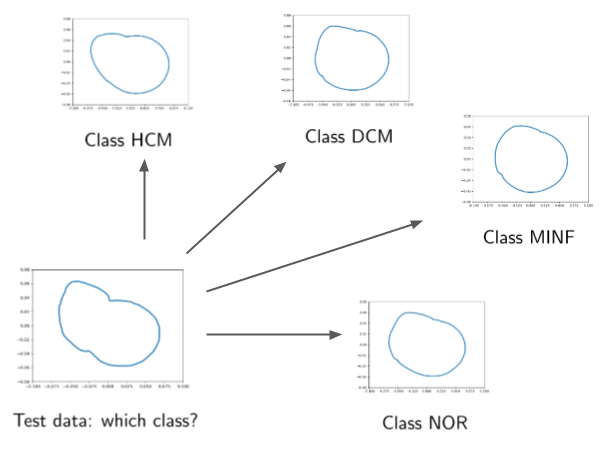

# P1-Cardiac-Motion
Utilise (dynamic) heart models based on manifold-valued Bézier splines to estimate the anatomical changes of the heart during the cardiac cycle.


Our main focus was on capturing the full motion cycle of the left ventricles middle slice in shape space and computing the mean motion for 
four groups (DCM, HCM, and MINF have heart diseases, NOR consists of healthy patients). 
We then used the computed mean trajectories to classify unseen slice motions according to the diseases given in the ACDC database. 
The picture below shows snapshots of each group's mean motion and of an unseen patient that was to be classified. The results are in the final slides.



> **_Note:_** When running the notebooks, make sure to use the newest version of [Morphomatics](https://morphomatics.github.io):
```bash
pip install -U git+https://github.com/morphomatics/morphomatics.git#egg=morphomatics
```

## Useful links:

A tutorial on regression with Bézier splines in Morphomatics can be found under https://morphomatics.github.io/tutorials/tutorial_regression/

ACDC challenge: https://acdc.creatis.insa-lyon.fr/

A Useful tool to visualise multi-dimensional (nifti) data: http://www.itksnap.org/pmwiki/pmwiki.php

## Literature

> Martin Hanik, Hans-Christian Hege, Christoph von Tycowicz:  
> **[A Nonlinear Hierarchical Model for Longitudinal Data on Manifolds.](http://arxiv.org/pdf/2202.01180)**  
> IEEE 19th International Symposium on Biomedical Imaging (ISBI), 2022.</br>
> [](http://arxiv.org/abs/2202.01180)
